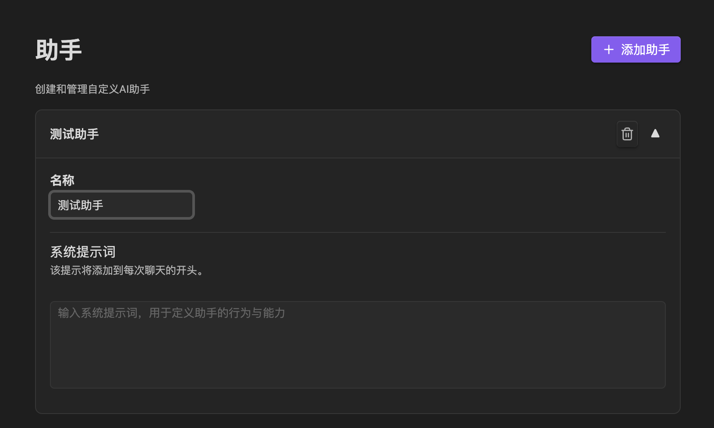

# 1. Installing the Plugin

- Open the Obsidian application and navigate to "Settings" (gear icon) in the bottom left corner. In the settings menu, find and click the "Community plugins" option. If you haven't enabled community plugins yet, make sure to first disable "Safe mode" (or "Restricted mode") to access and install third-party plugins.
- Click the "Browse" button, which will take you to Obsidian's community plugin store. In the search bar at the top of the store, type "Next Composer". The search results should display the "Next Composer" plugin. Click the "Install" button next to the plugin.
- After installation is complete, make sure to click the "Enable" button so the plugin can work properly in your Obsidian vault.

# 2. Configuring AI Model APIs

As shown in the image, the plugin comes with built-in support for multiple mainstream AI model providers, including OpenAI, Anthropic, Gemini, DeepSeek, and more. Click the gear icon on the right to enter the configuration page for the corresponding provider.

In the configuration interface, you can fill in the corresponding API Key. If you're using a third-party proxy service, you can also fill in the proxy address (if using default configuration, leave blank).

If the built-in providers don't meet your needs, you can also click "Add Custom Provider" to manually add new model services. It's generally recommended to set the Provider Type to OpenAI Compatible, which is currently the most universal interface format supported by the vast majority of proxy services and third-party model platforms on the market.

# 3. Custom Assistants/Agents

You can add your desired assistants in the "Assistants" section of settings.

# 4. RAG (Retrieval Augmented Generation)

RAG automatically retrieves the most relevant note snippets from your vault when you chat, serving as additional context for the model to help generate more accurate responses.

## Basic Usage

- Input questions in the sidebar chat and check "Vault Search", or use shortcuts to run Q&A with retrieval.
- When mentioned files are too long or exceed the "threshold token count", the system automatically switches to RAG, injecting only the most relevant snippets.
- When the model generates responses containing "quoted snippets" (smtcmp_block), they now default to collapsed to two lines. Click "Show more" to expand details.

## Setting Descriptions (Settings → RAG)

1. Embedding Model
   - Used to encode note text into vectors. By default, it's recommended to use OpenAI's text-embedding-3-large. For personal use, the actual cost difference from small is minimal, but the effectiveness is significantly better.

2. Include Mode / Selected Folders
   - Specify the file scope to participate in indexing.
   - Leave blank = default includes all.
   - Supports testing: click "Test Mode" to preview matched files.

3. Exclude Mode / Excluded Folders
   - Specify the file scope to exclude.
   - Exclusion priority is higher than inclusion; when conflicts occur, exclusion takes precedence.

4. Threshold Tokens
   - When directly injecting the content of mentioned files exceeds this token threshold, automatically switch to RAG, injecting only the most relevant snippets.

5. Minimum Similarity
   - The relevance lower bound for recall results, 0~1; higher values are stricter, returning fewer but more relevant results.

6. Limit
   - Maximum number of RAG results to inject; higher values provide more context but increase tokens.

7. Auto Update Index / Minimum Interval (Hours)
   - When enabled, if content in "included folders" changes, the system will perform incremental updates according to the "minimum interval" (default once daily).
   - You can click "Update Now" at any time to manually trigger an incremental update.

8. Manage Embedding Database / Rebuild Index
   - "Manage": View/maintain the embedding database.
   - "Rebuild Index": Full rebuild (recommended when chunk size, model, or include/exclude rules are modified).

9. RAG Index Progress
   - View the percentage and detailed status of the most recent indexing at the bottom of the RAG settings page.

## When to Rebuild Index?

- You've changed the "embedding model" or adjusted the "chunk size".
- You've significantly changed the "include/exclude" scope and want immediate effect.
- Recall effectiveness is noticeably abnormal, suspecting index inconsistency with settings.

## Troubleshooting Suggestions

- No recall results: Check if "include/exclude" filters out target files; lower "minimum similarity"; increase "limit".
- Irrelevant recall: Appropriately increase "minimum similarity", or reduce "chunk size" to make snippets more focused.
- Token limit exceeded: Reduce "limit", or increase "threshold tokens".

## Performance and Cost Recommendations

- Reasonably set "limit" and "minimum similarity" to avoid injecting too many snippets at once.
- Choose appropriate embedding models based on vault size: prioritize low-cost models for small vaults, stronger models for large vaults or cross-topic retrieval.

# 5. AI Continuation/Rewriting

The AI continuation feature supports two trigger methods: **right-click menu trigger** and **keyword trigger**.

## 1. Right-Click Menu Trigger

Right-click at the end of any paragraph to see "AI Continue" and "Custom Continue" options in the menu:

* **AI Continue**: Automatically calls all current context content and generates continuation results using the default Prompt configured in your settings;
* **Custom Continue**: Opens a floating window allowing you to manually input a Prompt and customize the style and content of the continuation.

You can also select partial paragraphs and right-click "Custom Continue", so the model will only use your selected paragraphs as context for continuation.

## 2. Keyword Trigger

After enabling keyword trigger, the plugin will monitor your input in real-time to see if it meets the trigger conditions. Once conditions are met, it will automatically execute AI continuation or open the custom Prompt floating window without manual operation.