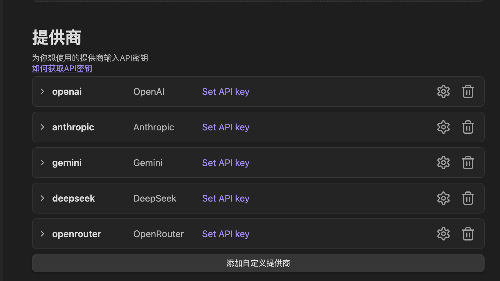

# 一、安装插件

- 打开Obsidian应用程序，进入左下角的“设置”（齿轮图标）。在设置菜单中，找到并点击“社区插件”选项。如果您尚未允许社区插件，请务必先关闭“安全模式”（或“限制模式”），这样才能访问和安装第三方插件。
- 点击“浏览”按钮，这将带您进入Obsian的社区插件商店。在商店顶部的搜索栏中，输入“Next Composer”。搜索结果中应该会显示“Next Composer”插件。点击该插件旁边的“安装”按钮。
- 安装完成后，请务必点击“启用”按钮，这样插件才能在您的Obsidian库中正常工作。

# 二、配置大模型 API

如图所示，插件已内置多个主流大模型供应商，包括 OpenAI、Anthropic、Gemini、DeepSeek 等。点击右侧的齿轮图标，即可进入对应供应商的配置页面。

在配置界面中，您可以填写对应的 API Key。如果您使用的是第三方中转服务，也可以填写中转地址（若使用默认配置，可留空）。

如果内置的供应商不满足您的需求，您还可以点击「添加自定义供应商」，手动添加新的模型服务。通常建议将 Provider Type 设置为 OpenAI Compatible，这是目前最通用的接口格式，绝大多数市面上的中转服务与第三方模型平台均支持该规范。

# 三、自定义助手/Agent

您可以在设置的「助手」分区添加您想要的助手。

# 四、RAG（检索增强生成）

RAG 会在你聊天时，自动从库中检索最相关的笔记片段，作为模型的额外上下文，帮助生成更准确的回答。

## 基本用法

- 在侧边栏聊天中输入问题，勾选“库搜索”（Vault Search），或使用快捷键运行带检索的问答。
- 当被提及的文件过长或超过“阈值令牌数”时，系统会自动切换为 RAG，只注入最相关的片段。
- 模型生成回复时包含“引用片段”（smtcmp_block），现在默认折叠为两行，点击 Show more 可展开详情。

## 设置项说明（设置 → RAG）

1. 嵌入模型（Embedding Model）
   - 用于把笔记文本编码为向量，默认建议使用OpenAI的text-embedding-3-large，个人使用实际成本和small并无太大区别，效果还会好不少。

2. 包含模式 / 已选择的文件夹
   - 指定需要参与索引的文件范围。
   - 留空＝默认包含全部。
   - 支持测试：点击“测试模式”预览命中文件。

3. 排除模式 / 已排除的文件夹
   - 指定需要排除的文件范围。
   - 排除优先级高于包含；当两者冲突时，以排除为准。

4. 阈值令牌数（Threshold Tokens）
   - 当直接注入被提及文件的内容总 tokens 超过该阈值时，自动切换为 RAG，仅注入最相关的片段。

5. 最小相似度（Minimum Similarity）
   - 召回结果的相关性下限，0~1；值越高越严格，返回更少但更相关的结果。

6. 限制（Limit）
   - 最多注入多少条 RAG 结果；值越大，上下文越多，但 tokens 也会增加。

7. 自动更新索引 / 最小间隔（小时）
   - 打开后，当“已包含的文件夹”中的内容有变化，系统会按“最小间隔”自动做增量更新（默认每日一次）。
   - 可随时点击“立即更新”手动触发一次增量更新。

8. 管理嵌入数据库 / 重建索引
   - “管理”：查看/维护嵌入数据库。
   - “重建索引”：全量重建（例如修改了分块大小、模型、包含/排除规则时建议执行）。

9. RAG 索引进度
   - 在 RAG 设置页底部可查看最近一次索引的进度百分比及详细情况。

## 何时需要重建索引？

- 你更换了“嵌入模型”或调整了“分块大小”。
- 大幅变更了“包含/排除”范围并希望立即生效。
- 召回效果明显异常，怀疑索引与设置不一致。

## 排错建议

- 没有召回结果：检查“包含/排除”是否把目标文件过滤掉；降低“最小相似度”；增大“限制”。
- 召回不相关：适当增大“最小相似度”，或调小“分块大小”让片段更加聚焦。
- token 超限：降低“限制”，或提高“阈值令牌数”。

## 性能与成本建议

- 合理设置“限制”和“最小相似度”，避免一次性注入过多片段。
- 根据库规模选择合适的嵌入模型，小库优先低成本模型，大库或跨主题检索可选择更强模型。

# 五、AI续写/改写

AI 续写功能支持两种触发方式：**右键菜单触发**和**关键词触发**。

## 1. 右键菜单触发

在任意段落末尾点击右键，即可在菜单中看到「AI续写」与「自定义续写」两个选项：

* **AI续写**：自动调用当前全部上下文内容，并结合您在设置中配置的默认 Prompt 生成续写结果；
* **自定义续写**：将打开一个悬浮窗，允许您手动输入 Prompt，自定义续写的风格与内容。

您也可以选中部分段落，右键「自定义续写」，这样模型只会根据您选中的段落作为上下文来进行续写。

## 2. 关键词触发

开启关键词触发后，插件会实时检测您输入的内容是否符合触发条件。一旦满足条件，将自动执行 AI 续写或弹出自定义 Prompt 悬浮窗，无需手动操作。